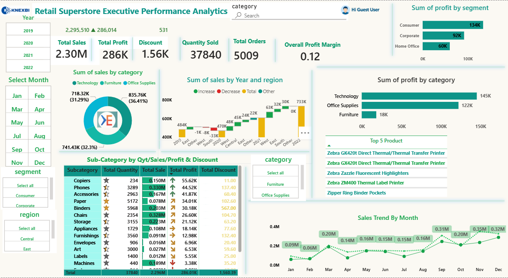

# Retail Superstore Executive Performance Analytics

End-to-end data analytics project: **Excel (cleaning) → SQL (analysis) → Power BI (dashboard)**.



## Business Problem
Which categories, segments, regions and states drive sales and profit, and where are discounts hurting margins? This project answers those questions for a retail superstore's leadership team.

## Dataset
- Retail Superstore sales data, **2019 to 2022**
- **9,986 order line items** across **5,009 orders** and **793 customers**, 19 columns (orders, customers, products, sales, profit, discount, region, state)
- Source: [https://www.kaggle.com/datasets/timchant/supstore-dataset-2019-2022?resource=download]

## Tools Used
Excel | MySQL | Power BI | DAX

## Stage 1: Data Cleaning (Excel)
- Removed ~70-80 duplicate records using Excel's Remove Duplicates on `order_id` + `product_name`
- Converted text dates (dd-mm-yyyy) into proper date fields
- Checked for null values (none remaining) and validated row counts across Excel, SQL and Power BI
- Fixed corrupted special characters in customer and product names caused by file encoding

## Stage 2: Analysis (SQL)
16 queries answering business questions on revenue, profit, regions, states, categories, segments and discounts. Techniques used: `GROUP BY`, `HAVING`, `CASE`, CTEs and window functions (`LAG`, `RANK`).

```sql
SELECT category, ROUND(SUM(sales),2) AS revenue, ROUND(SUM(profit),2) AS total_profit,
       ROUND(SUM(profit)/SUM(sales)*100,2) AS profit_margin_pct
FROM superstore
GROUP BY category
ORDER BY revenue DESC;
```
Full script: [`sql/sales_analysis.sql`](sql/sales_analysis.sql)

## Stage 3: Dashboard (Power BI)
- **KPI cards:** Total Sales, Total Profit, Discount, Quantity Sold, Total Orders, Profit Margin
- **Visuals:** sales by category (donut), sales by year and region (waterfall), profit by segment and category (bars), sub-category table with icons and data bars, monthly sales trend, top 5 products
- **Slicers:** Year, Month, Segment, Region, Category
- **DAX:** measures for totals and margin, plus conditional formatting for profit up/down indicators

## Key Insights
- Total sales of **2.30M** and profit of **286K**, an overall margin of **12.5%**.
- Sales grew from **484K (2019)** to **733K (2022)**, with growth of 29% in 2021 and 20% in 2022 after a small dip in 2020.
- **Technology** earns the most profit (145K, 17.4% margin). **Furniture** is the weak spot: 741K in sales but only 18K profit, a **2.5% margin**.
- **Tables, Bookcases and Supplies** lose money, and Tables alone lose about 17.7K.
- **10 states are loss-making**, led by **Texas (-25.7K), Ohio (-17.0K) and Pennsylvania (-15.6K)**. California (76K) and New York (74K) are the most profitable.
- **Discounts above 20% destroy profit:** items sold at 21-40% discount lost 35.8K in total, and items at 40%+ lost 99.6K, while undiscounted items made 320.7K.
- The **Central** region has the lowest margin (7.9%) against 14.9% in the West.

## Recommendations
1. Cap discounts at 20%, since deeper discounts turn profitable products into losses.
2. Review pricing and costs for Furniture, especially Tables and Bookcases.
3. Investigate why Texas, Ohio and Pennsylvania are loss-making (discounting, shipping or product mix).
4. Focus growth on Technology and Office Supplies, which combine strong sales with healthy margins.

## Project Structure
```
├── data/
│   ├── raw/        original dataset
│   └── cleaned/    cleaned dataset used for SQL and Power BI
├── sql/            analysis queries
├── powerbi/        Power BI dashboard (.pbix)
├── images/         dashboard screenshot
└── README.md
```

## How to Run
1. Load `data/cleaned/superstore_cleaned.csv` into MySQL using the setup section of `sql/sales_analysis.sql` (update the file path).
2. Run the queries in order.
3. Open the `.pbix` file in Power BI Desktop to explore the dashboard.

## Contact
[Himanshu Painuly] | [https://www.linkedin.com/in/himanshu-painuly-1924a7295] | [himanshu.painuly98@gmail.com]
